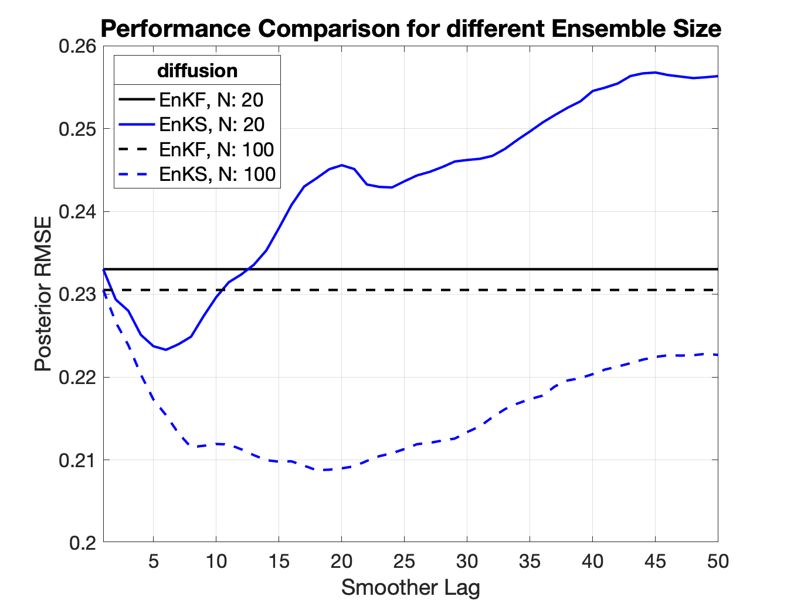
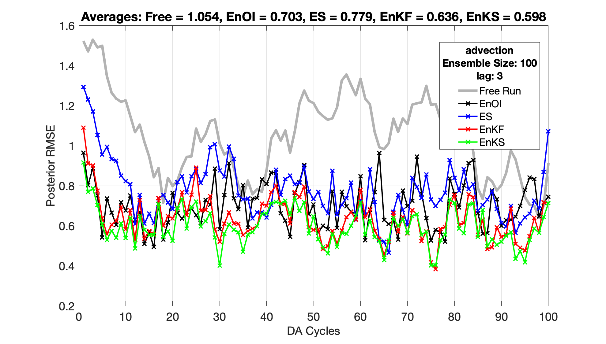

## EnKF_EnOI_ES_EnKS
   
  A toy DA system that uses a (forced) 1D linear diffusion/advection model to compare
  the following ensemble DA schemes: 
  - Ensemble Kalman Filter: EnKF
  - Ensemble Optimal Interpolation: EnOI
  - Ensemble Smoother: ES
  - Ensemble Kalman Smoother: EnKS
  
 The update scheme considers the observations all at once (i.e., batch style)
 and uses the transformation matrix (X5; Evensen, 2003). I also provided
 an EnKS function that assimilates the observations serially and uses 
 DART's style (2-step update, Anderson, 2003). 
 
 This a mere educational package. The coding style (in MATLAB) is not *top-notch*. 
 The intent is to familiarize the user with different ensemble schemes, 
 their implementation and performance.
 
 - - - -
 
 To start, you can run `DA_EnKF_EnOI_ES_EnKS.m` to compare the different schemes in an OSSE framework. You can choose the *model* (advection or diffusion)) *ensemble size* and the *smoother lag*
`DA_EnKF_EnOI_ES_EnKS.m` calls the separate functions: `EnKF.m`, `EnOI.m`, `ES.m` and `EnKS.m` To simulate a realistic scenario, 2 model parameters are perturbed. Thus, the forecast model is different than the one used to generate the truth.   
 
 To study the effect of the length of the *lag*, you can run `compare_enkf_enks_lags.m` and see a comparison between the EnKF and EnKS. You will get results similar to those in the figures below.  
 
 The script `run_models_offline.m` shows the evolution of the truth in time.  
 
 

 

<!---
<table><tr>
<td></td> 
<td></td>
</tr></table>
--!>

<!--  --!>
